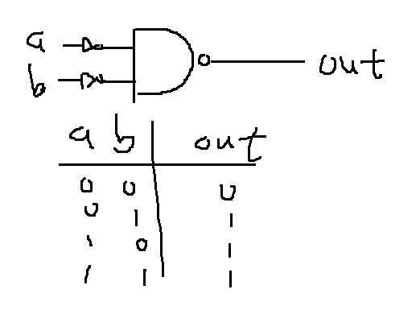

### Not 
* picture


* code

```
Nand(a=in, b=in, out=out);
```
### And
* picture


* code

```
Nand(a=a, b=b, out=AnandB);
Not(in=AnandB, out=out);
```
### Or
* picture


* code

```
Not(in=a, out=na);
Not(in=b, out=nb);
Nand(a=na, b=nb, out=out);
```
