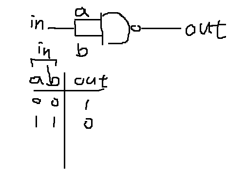
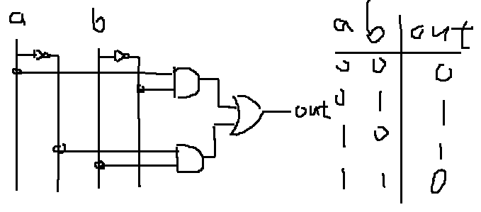
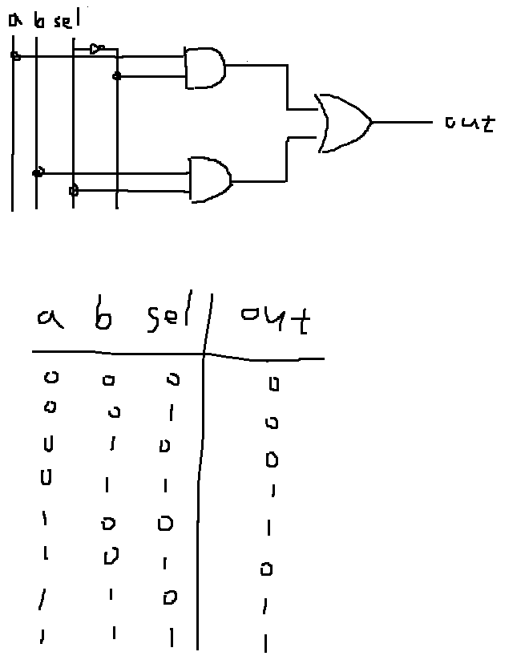
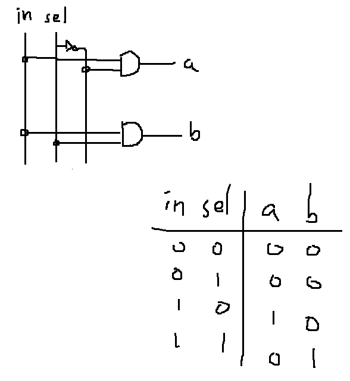

### Not 
* picture


* code

```
Nand(a=in, b=in, out=out);
```
### And
* picture


* code

```
Nand(a=a, b=b, out=AnandB);
Not(in=AnandB, out=out);
```
### Or
* picture


* code

```
Not(in=a, out=na);
Not(in=b, out=nb);
Nand(a=na, b=nb, out=out);
```
### Xor
* picture


* code

```
Not(in=b, out=nb);
Not(in=a, out=na);
And(a=a, b=nb, out=AandnB);
And(a=na, b=b, out=nAandB);
Or(a=AandnB, b=nAandB, out=out);
```
### Mux
* picture


* code

```
Not(in=sel, out=nsel);
And(a=a, b=nsel, out=AandnS);
And(a=b, b=sel, out=BandS);
Or(a=AandnS, b=BandS, out=out);
```
### DMux
* picture


* code

```
Not(in=sel, out=nsel);
And(a=in, b=nsel, out=a);
And(a=in, b=sel, out=b);
```
