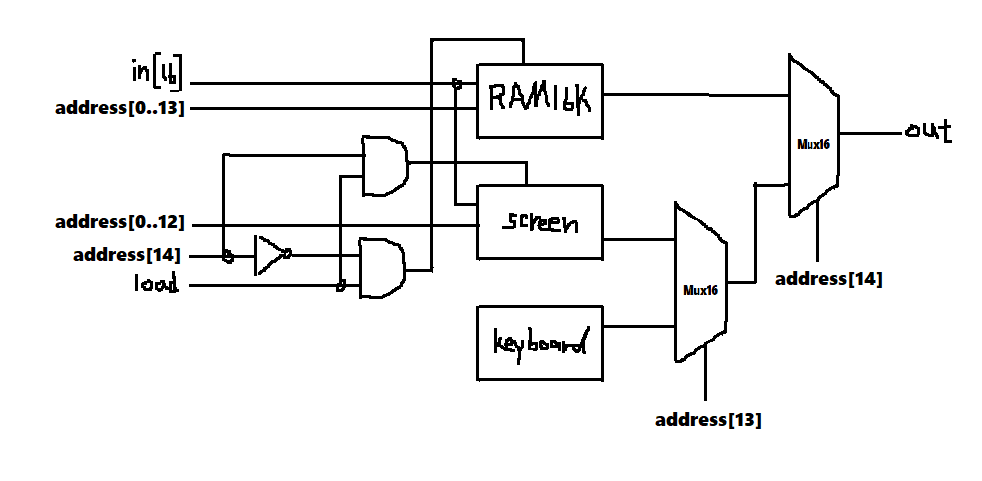

### Memory
* picture


* code

```
Not(in = address[14], out = nad);
And(a = address[14], b = load, out = sload);
And(a = nad, b = load, out = rload);

RAM16K(in = in, address = address[0..13], load = rload, out = R);
Screen(in = in, address = address[0..12], load = sload, out = S);
Keyboard(out = K);

Mux16(a = S, b = K, sel = address[13], out = SK);
Mux16(a = R, b = SK, sel = address[14], out = out);
```