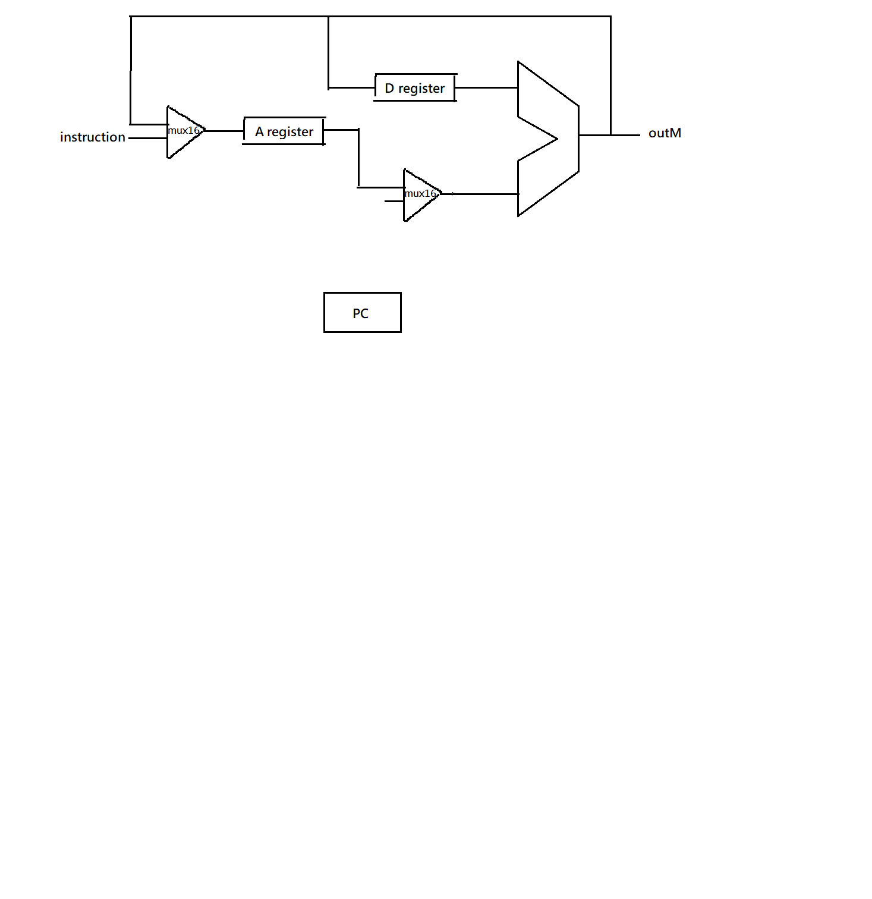

### CPU
* picture


* code

```
// Decode
Or16(a = false, b = instruction, out[15] = isC, out[12] = a, out[11] = c1, out[10] = c2, out[9] = c3, out[8] = c4, out[7] = c5, out[6] = c6, out[5] = d1, out[4] = d2, out[3] = d3, out[2] = j1, out[1] = j2, out[0] = j3);

// Mux16-1
Mux16(a = instruction, b = ALUout, out = Mux16out1);

// A register
Not(in = isC, out = isA);
And(a = isC, b = d1, out = isCd1);
or(a = isA, b = isCd1, out = Aload);
ARegister(in = Mux16out1, load = Aload, out = Aout, out[0..14] = addressM);

// Mux16-2
Mux16(a = Aout, b = inM, sel = isC, out = Mux16out2);

// D register
And(a = isC, b = d2, out = isCd2);
DRegister(in = ALUout, load = isCd2, out = Dout);

// ALU
ALU(a = Dout, b = Mux16out2, zx = c1, nx = c2, zy = c3, ny = c4, f = c5, no = c6, out = outM, zr = zr, ng = ng);

// Jump
And(a = ng, b = j1, out = jumpLT);
And(a = zr, b = j2, out = jumpEQ);
Or(a = ng, b = zr, out = ngzr);
Not(in = ngzr, out = gt);
And(a = gt, b = j3, out = jumpGT);

Or(a = jumpLT, b = jumpEQ, out = jumpLE);
Or(a = jumpLE, b = jumpGT, out = jump);

// PC
And(a = isC, b = jump, out = PCload);
PC(in = Aout, load = PCload, reset = reset, inc = true, out[0..14] = pc);

// writeM
And(a = isC, b = d3, out = writeM)
```