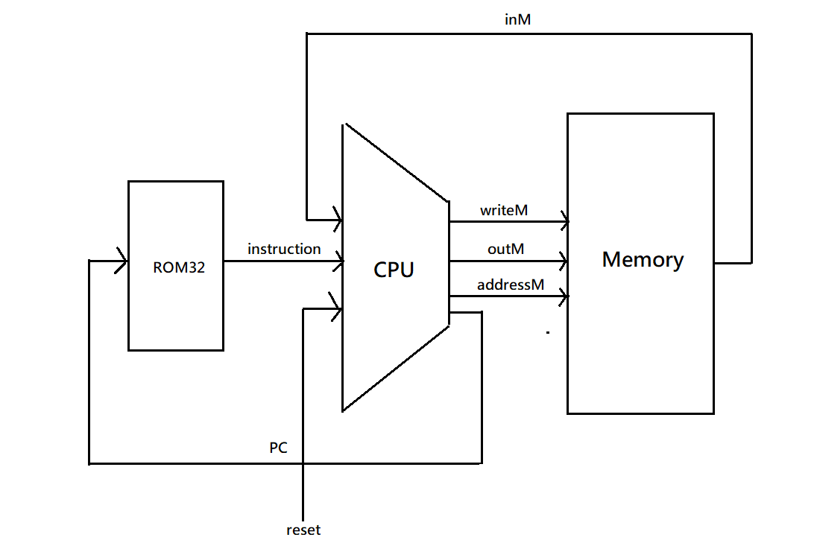

### Computer
* picture


* code

```
ROM32K(address = pc, out = instruction);
CPU(inM = inM, instruction = instruction, reset = reset, writeM = writeM, outM = outM, addressM = addressM, pc = pc);
Memory(in = outM, address = addressM, load = writeM, out = inM);
```