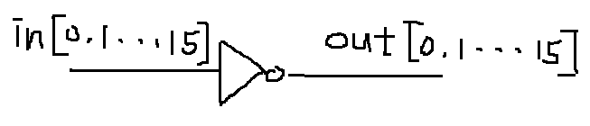
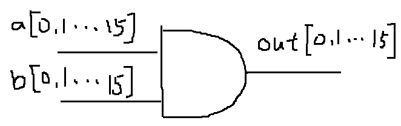
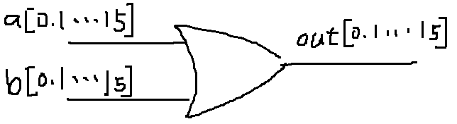
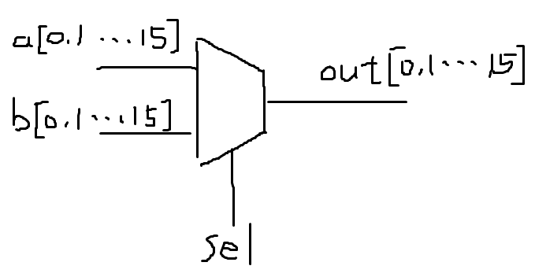
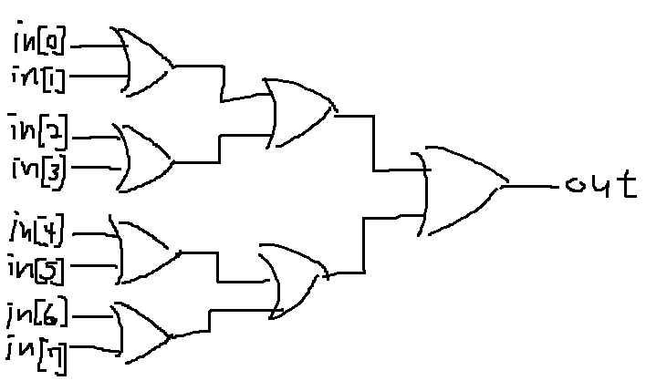
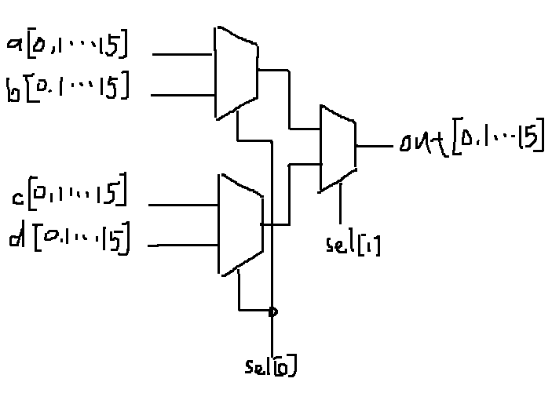
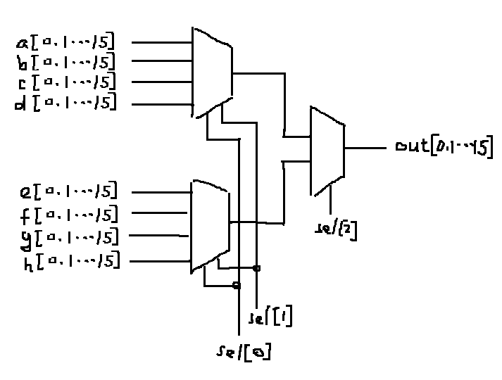
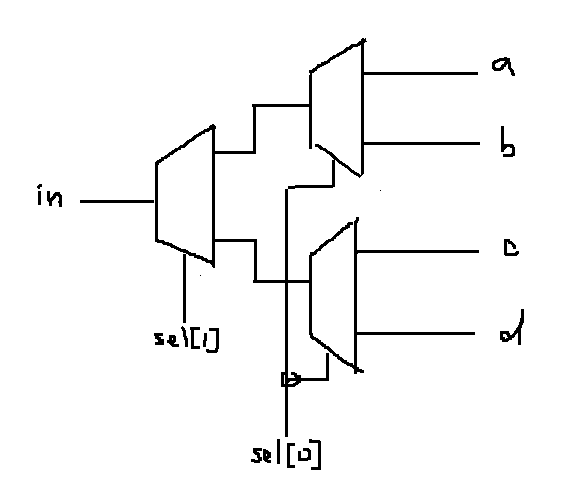
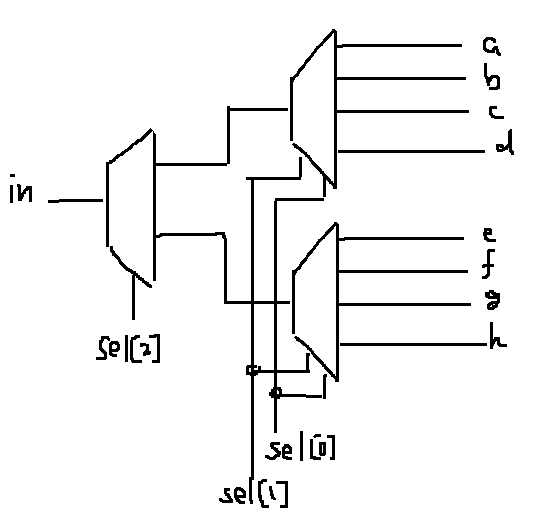

### Not16
* picture


* code

```
    Not(in=in[0], out=out[0]);
    Not(in=in[1], out=out[1]);
    Not(in=in[2], out=out[2]);
    Not(in=in[3], out=out[3]);
    Not(in=in[4], out=out[4]);
    Not(in=in[5], out=out[5]);
    Not(in=in[6], out=out[6]);
    Not(in=in[7], out=out[7]);
    Not(in=in[8], out=out[8]);
    Not(in=in[9], out=out[9]);
    Not(in=in[10], out=out[10]);
    Not(in=in[11], out=out[11]);
    Not(in=in[12], out=out[12]);
    Not(in=in[13], out=out[13]);
    Not(in=in[14], out=out[14]);
    Not(in=in[15], out=out[15]);
```
### And16
* picture


* code

```
    And(a=a[0], b=b[0], out=out[0]);
    And(a=a[1], b=b[1], out=out[1]);
    And(a=a[2], b=b[2], out=out[2]);
    And(a=a[3], b=b[3], out=out[3]);
    And(a=a[4], b=b[4], out=out[4]);
    And(a=a[5], b=b[5], out=out[5]);
    And(a=a[6], b=b[6], out=out[6]);
    And(a=a[7], b=b[7], out=out[7]);
    And(a=a[8], b=b[8], out=out[8]);
    And(a=a[9], b=b[9], out=out[9]);
    And(a=a[10], b=b[10], out=out[10]);
    And(a=a[11], b=b[11], out=out[11]);
    And(a=a[12], b=b[12], out=out[12]);
    And(a=a[13], b=b[13], out=out[13]);
    And(a=a[14], b=b[14], out=out[14]);
    And(a=a[15], b=b[15], out=out[15]);
```
### Or16
* picture


* code

```
    Or(a=a[0], b=b[0], out=out[0]);
    Or(a=a[1], b=b[1], out=out[1]);
    Or(a=a[2], b=b[2], out=out[2]);
    Or(a=a[3], b=b[3], out=out[3]);
    Or(a=a[4], b=b[4], out=out[4]);
    Or(a=a[5], b=b[5], out=out[5]);
    Or(a=a[6], b=b[6], out=out[6]);
    Or(a=a[7], b=b[7], out=out[7]);
    Or(a=a[8], b=b[8], out=out[8]);
    Or(a=a[9], b=b[9], out=out[9]);
    Or(a=a[10], b=b[10], out=out[10]);
    Or(a=a[11], b=b[11], out=out[11]);
    Or(a=a[12], b=b[12], out=out[12]);
    Or(a=a[13], b=b[13], out=out[13]);
    Or(a=a[14], b=b[14], out=out[14]);
    Or(a=a[15], b=b[15], out=out[15]);
```
### Mux16
* picture


* code

```
    Mux(a=a[0], b=b[0], sel=sel, out=out[0]);
    Mux(a=a[1], b=b[1], sel=sel, out=out[1]);
    Mux(a=a[2], b=b[2], sel=sel, out=out[2]);
    Mux(a=a[3], b=b[3], sel=sel, out=out[3]);
    Mux(a=a[4], b=b[4], sel=sel, out=out[4]);
    Mux(a=a[5], b=b[5], sel=sel, out=out[5]);
    Mux(a=a[6], b=b[6], sel=sel, out=out[6]);
    Mux(a=a[7], b=b[7], sel=sel, out=out[7]);
    Mux(a=a[8], b=b[8], sel=sel, out=out[8]);
    Mux(a=a[9], b=b[9], sel=sel, out=out[9]);
    Mux(a=a[10], b=b[10], sel=sel, out=out[10]);
    Mux(a=a[11], b=b[11], sel=sel, out=out[11]);
    Mux(a=a[12], b=b[12], sel=sel, out=out[12]);
    Mux(a=a[13], b=b[13], sel=sel, out=out[13]);
    Mux(a=a[14], b=b[14], sel=sel, out=out[14]);
    Mux(a=a[15], b=b[15], sel=sel, out=out[15]);
```
### Or8Way
* picture


* code

```
    Or(a=in[0], b=in[1], out=0or1);
    Or(a=in[2], b=in[3], out=2or3);
    Or(a=in[4], b=in[5], out=4or5);
    Or(a=in[6], b=in[7], out=6or7);
    Or(a=0or1, b=2or3, out=01or23);
    Or(a=4or5, b=6or7, out=45or67);
    Or(a=01or23, b=45or67, out=out);
```
### Mux4Way16
* picture


* code

```
    Mux16(a=a, b=b, sel=sel[0], out=amuxb);
    Mux16(a=c, b=d, sel=sel[0], out=cmuxd);
    Mux16(a=amuxb, b=cmuxd, sel=sel[1], out=out);
```
### Mux8Way16
* picture


* code

```
    Mux4Way16(a=a, b=b, c=c, d=d, sel=sel[0..1], out=abmux4cd);
    Mux4Way16(a=e, b=f, c=g, d=h, sel=sel[0..1], out=efmux4gh);
    Mux16(a=abmux4cd, b=efmux4gh, sel=sel[2], out=out);
```
### DMux4Way
* picture


* code

```
    DMux(in=in, sel=sel[1], a=admuxb, b=cdmuxd);
    DMux(in=admuxb, sel=sel[0], a=a, b=b);
    DMux(in=cdmuxd, sel=sel[0], a=c, b=d);
```
### DMux8Way
* picture


* code

```
    DMux(in=in, sel=sel[2], a=admuxb, b=cdmuxd);
    DMux4Way(in=admuxb, sel=sel[0..1], a=a, b=b, c=c, d=d);
    DMux4Way(in=cdmuxd, sel=sel[0..1], a=e, b=f, c=g, d=h);
```
