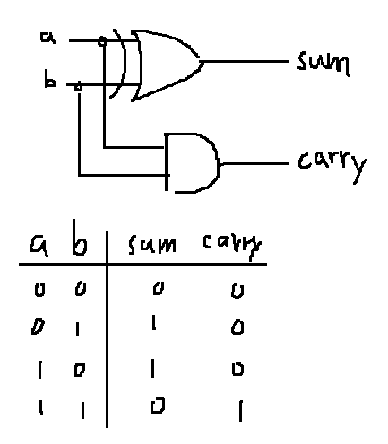
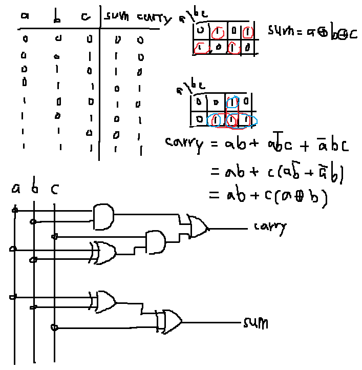
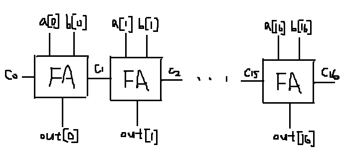
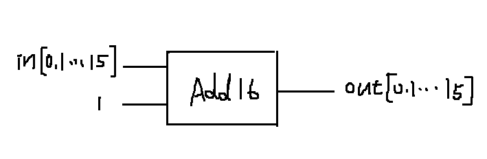

### HalfAdder
* picture


* code

```
    Xor(a=a,b=b,out=sum);
    And(a=a,b=b,out=carry);
```
### FullAdder
* picture


* code

```
    And(a=a, b=b, out=aandb);
    Xor(a=a, b=b, out=axor1b);
    And(a=axor1b, b=c, out=axor1bandc);
    Or(a=aandb, b=axor1bandc, out=carry);
    Xor(a=a, b=b, out=axor2b);
    Xor(a=axor2b, b=c, out=sum);
```
### Add16
* picture


* code

```
   FullAdder(a=a[0], b=b[0], c=false, sum=out[0], carry=c1);
   FullAdder(a=a[1], b=b[1], c=c1, sum=out[1], carry=c2);
   FullAdder(a=a[2], b=b[2], c=c2, sum=out[2], carry=c3);
   FullAdder(a=a[3], b=b[3], c=c3, sum=out[3], carry=c4);
   FullAdder(a=a[4], b=b[4], c=c4, sum=out[4], carry=c5);
   FullAdder(a=a[5], b=b[5], c=c5, sum=out[5], carry=c6);
   FullAdder(a=a[6], b=b[6], c=c6, sum=out[6], carry=c7);
   FullAdder(a=a[7], b=b[7], c=c7, sum=out[7], carry=c8);
   FullAdder(a=a[8], b=b[8], c=c8, sum=out[8], carry=c9);
   FullAdder(a=a[9], b=b[9], c=c9, sum=out[9], carry=c10);
   FullAdder(a=a[10], b=b[10], c=c10, sum=out[10], carry=c11);
   FullAdder(a=a[11], b=b[11], c=c11, sum=out[11], carry=c12);
   FullAdder(a=a[12], b=b[12], c=c12, sum=out[12], carry=c13);
   FullAdder(a=a[13], b=b[13], c=c13, sum=out[13], carry=c14);
   FullAdder(a=a[14], b=b[14], c=c14, sum=out[14], carry=c15);
   FullAdder(a=a[15], b=b[15], c=c15, sum=out[15], carry=c16);
```
### Inc16
* picture


* code

```
    Add16(a=in, b[0]=true, b[1..15]=false, out=out);
```
