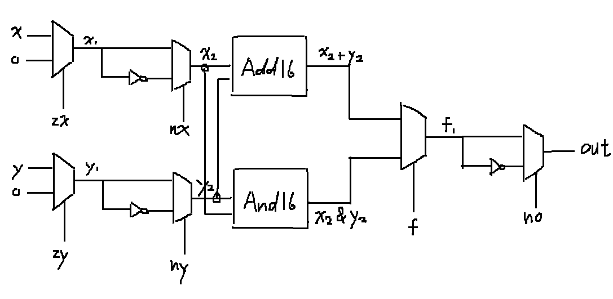
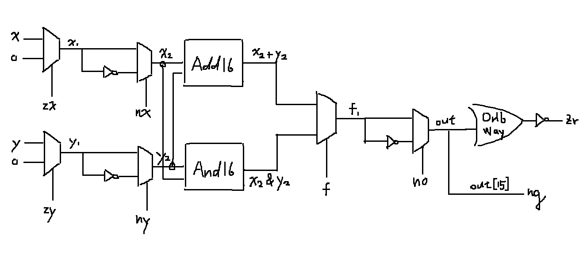

### ALU-nostat
* picture


* code

```
Mux16(a=x, b=false, sel=zx, out=x1);
Mux16(a=y, b=false, sel=zy, out=y1);
Not16(in=x1, out=notx1);
Not16(in=y1, out=noty1);
Mux16(a=x1, b=notx1, sel=nx, out=x2);
Mux16(a=y1, b=noty1, sel=ny, out=y2);
Add16(a=x2, b=y2, out=x2addy2);
And16(a=x2, b=y2, out=x2andy2);
Mux16(a=x2andy2, b=x2addy2, sel=f, out=f1);  
Not16(in=f1, out=notf1);
Mux16(a=f1, b=notf1, sel=no, out=out);
```
### ALU
* picture


* code

```
Mux16(a=x, b=false, sel=zx, out=x1);
Mux16(a=y, b=false, sel=zy, out=y1);
Not16(in=x1, out=notx1);
Not16(in=y1, out=noty1);
Mux16(a=x1, b=notx1, sel=nx, out=x2);
Mux16(a=y1, b=noty1, sel=ny, out=y2);
Add16(a=x2, b=y2, out=x2addy2);
And16(a=x2, b=y2, out=x2andy2);
Mux16(a=x2andy2, b=x2addy2, sel=f, out=f1);  
Not16(in=f1, out=notf1);
Mux16(a=f1, b=notf1, sel=no, out=out, out[0..7]=outlow, out[8..15]=outhigh, out[15]=ng);
Or8Way(in=outlow, out=or8wayoutlow);
Or8Way(in=outhigh, out=or8wayouthigh);
Or(a=or8wayoutlow, b=or8wayouthigh, out=oroutlowororouthigh);
Not(in=oroutlowororouthigh, out=zr);
```
