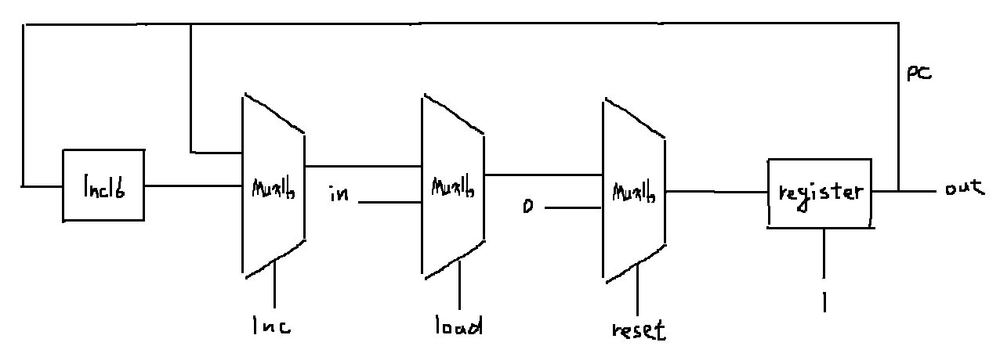

### PC
* picture


* code

```
Inc16(in=out0, out=out1);
Mux16(a=out0, b=out1, sel=inc, out=outi);
Mux16(a=outi, b=in, sel=load, out=outlo);
Mux16(a=outlo, b=false, sel=reset, out=outre);
Register(in=outre, load=true, out=out, out=out0);
```
